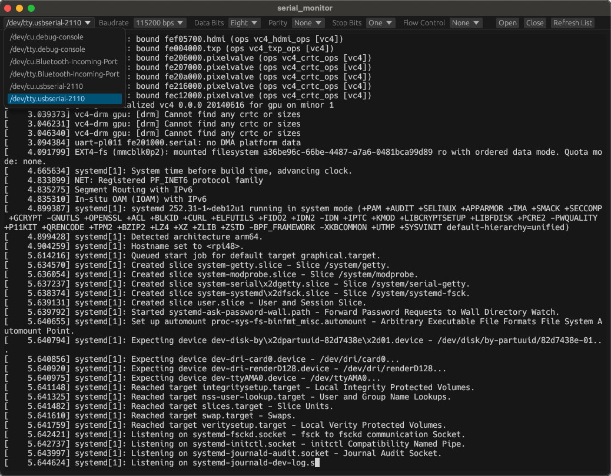

# egui_serial_term

Terminal emulator widget powered by EGUI framework and alacritty terminal backend.

Forked from [egui_term](https://github.com/Harzu/egui_term) to use serial TTY monitor.

## Features

The widget is currently under development and does not provide full terminal features make sure that widget is covered everything you want.

- TTY content rendering
- Multiple instance support
- Basic keyboard input
- Adding custom keyboard or mouse bindings
- Resizing
- Scrolling
- Focusing
- Selecting
- Changing Font/Color scheme
- Hyperlinks processing (hover/open)

This widget tested on MacOS and Linux and is not tested on Windows.

## Examples

You can also look at [examples](./examples) directory for more information about widget using.

- [serial_monitor](./examples/serial_monitor/) - The basic example of serial monitor.
- [custom_bindings](./examples/custom_bindings/) - The example that show how you can add custom keyboard or mouse bindings to your terminal emulator app.
- [themes](./examples/themes/) - The example that show how you can change terminal color scheme.
- [fonts](./examples/fonts/) - The examples that show how you can change font type or font size in your terminal emulator app.

## Dependencies

 - [egui (0.31.0)](https://github.com/emilk/egui)
 - [alacritty_terminal (0.25.0)](https://github.com/alacritty/alacritty)
